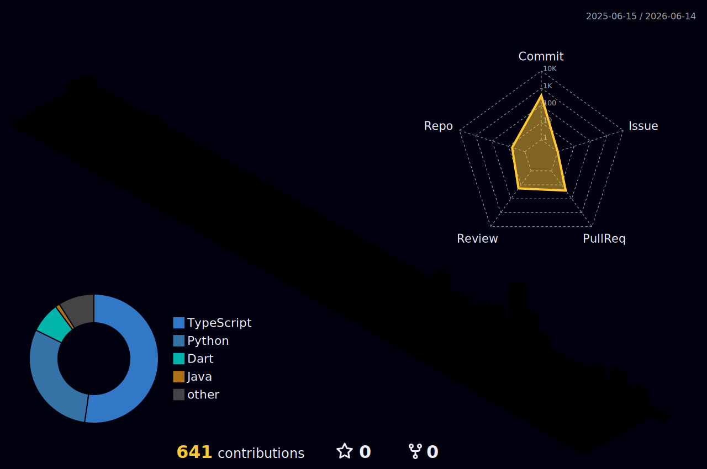

  

<!-- HEADER -->

  

  <h3>🎓 2nd Year Undergraduate | Informatics Institute of Technology (IIT) | University of Westminster (UoW)</h3>

  

    
    
    
  

  

    
  

---

### ✨ Building ideas with code, design, and intelligent systems

I enjoy creating meaningful digital products by combining  
**software engineering**, **UI/UX design**, **IoT**, and **machine learning**.

---

### About Me

Hi! I’m **Sanuthmee**, a second-year undergraduate at **IIT**, studying under the **University of Westminster (UoW)** degree program.  
I’m passionate about combining **technology, design, and intelligent systems** — exploring how creative code can make a meaningful difference.

- Currently learning: **Three.js**, **Node.js**, and **IoT-based systems**
- Completed courses in: **Python**, **MySQL**, **Java OOP**, **Machine Learning**, and **React**
- Interested in: **Machine Learning**, **Creative Coding**, **3D Visualization**, and **Human-Computer Interaction**
- Experienced in **Flutter + Firebase**, **React**, **Node.js**, and **Python pipelines**
- Goal: To bridge creativity and engineering in everything I build

---

### 🧠 Featured Projects

####  [BlokC – Smart Building Blocks for STEM Learning](https://github.com/STEM-Cognitive-Cubes)

**Tech:** IoT | Machine Learning | 3D Modeling | React | Figma | Node.js | Cloudflare

- Developed a **smart IoT block system** that studies children’s play patterns
- Uses **sensors + ESP-NOW + BLE** for data collection and pattern analysis
- Recreates real-time **3D structures** using **Three.js**
- Provides analytical insights into **creativity, structure-building, and problem-solving skills**

---

####  [Alviora – Flutter + Firebase Product App](https://github.com/sanuthmee1578/Alviora)

**Tech:** Flutter | Firebase | Python | NumPy

- Built for a **university competition**, integrating **ML-inspired data pipelines**
- Supports **real-time Firebase operations** and smooth UI/UX flows
- Includes features such as health monitoring, alerts, emergency flows, and interactive user screens
- Public repo showing my early-stage mobile app development process

---

####  Street Bulbs IoT System

**Tech:** Node.js | MySQL | ESP Modules | REST APIs

- Designed a smart street-light management concept
- Focused on **real-time control**, automation, and energy efficiency
- Explored IoT communication between hardware and backend services

---

####  React & Three.js Learning Repos

**Tech:** React | JavaScript | Three.js

- Sandbox projects exploring **3D web rendering** and interactive visual environments
- Includes experiments with objects, scenes, animations, and creative coding ideas

---

### 🛠️ Tech Stack

  

---

### Contributions Calendar

  

---

### GitHub Analytics

  

  

---

### 🤝 Connect With Me

  
  
  

---

  

  <i>“Exploring the space where creativity meets code — and building my way through it.”</i> ✨

